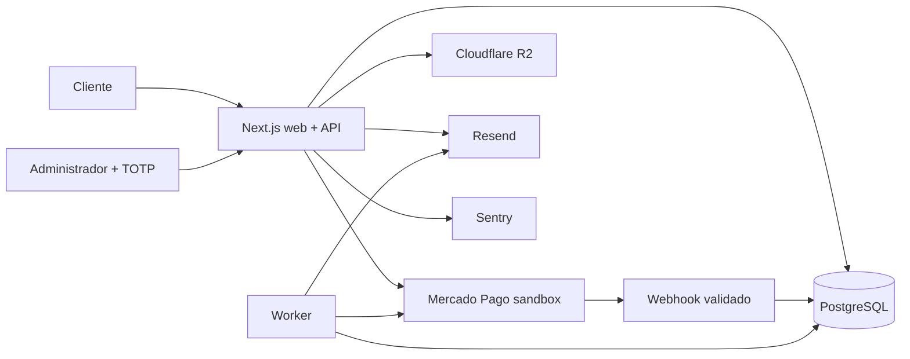

# Arquitectura y decisiones

## Contexto

PUDU v1 es un comercio chileno de compra invitada. El objetivo es reducir complejidad operativa sin sacrificar integridad de inventario, pagos ni datos personales.

## Componentes

## Decisiones

1. Monolito modular: una imagen, contratos compartidos y dos procesos reducen la superficie de despliegue.
2. PostgreSQL como fuente de verdad: precios, zonas, stock, reservas y estados se recalculan en servidor.
3. Dinero entero CLP: no se usan flotantes para importes.
4. Compra invitada: el estado se protege con un token público aleatorio almacenado solo como hash.
5. Checkout alojado: Mercado Pago procesa tarjetas fuera del dominio PUDU.
6. Reserva de 30 minutos: la creación se ejecuta con aislamiento serializable y evita sobreventa.
7. Panel separado visualmente: `/admin` no comparte navegación, consentimiento ni analítica pública.
8. Activos conceptuales: se identifican como provisionales hasta su reemplazo por producción.
9. Contenedores: `standalone` reduce la imagen; migración y seed son pasos separados del proceso web.
10. Migraciones hacia delante: el rollback revierte aplicación, no destruye datos.

## Contratos

- API pública bajo `/api/v1`.
- Validación Zod y errores `application/problem+json`.
- Paginación por cursor en catálogo.
- Fechas UTC en persistencia y `Intl` en interfaz.
- Webhooks firmados, idempotentes y sin confianza en el retorno del navegador.

## Límites de v1

No incluye cuentas de cliente, cupones, ERP, courier automático, fidelización, multiidioma ni venta internacional.
